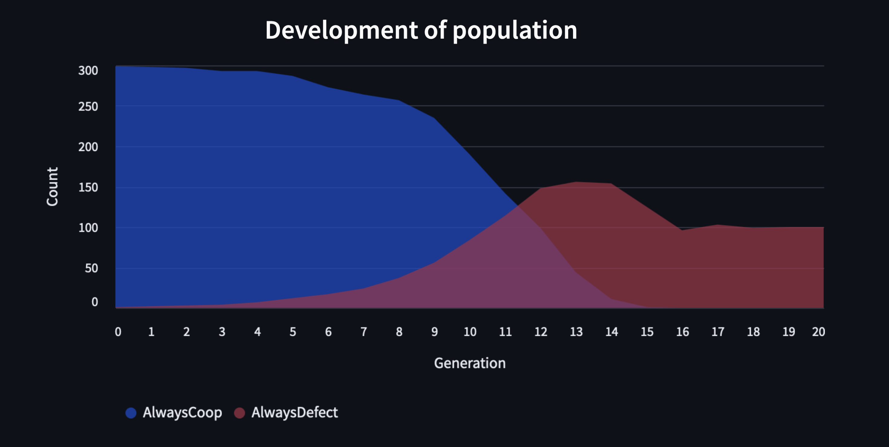

# Prisoner's Dilemma Simulation

This repository contains a simulation of the prisoner's dilemma with various strategies, inspired by [this Veritasium video](https://www.youtube.com/watch?v=mScpHTIi-kM&t=995s), which is based on [Robert Axelrod's research](https://en.wikipedia.org/wiki/Robert_Axelrod).

## The Prisoner's Dilemma
I've always found the prisoner's dilemma fascinating. Since the Nash Equilibrium is not the best outcome, what is then the "best" thing to do? That, of course, depends on what others are doing. But does there still exist a reasonable definition of a strategy being "oftentimes better" than others? Maybe we can simulate it to get a better intuition for this problem (or at least have fun)? Well... that is the purpose of this repository. To simulate an ecosystem with various strategies ("species") compete and grow or decline in numbers, maybe going extinct.

You can change the `config.ini` file to change the rewards and penalties for each outcome (payoff matrix).

## Project Structure

- `README.md`: This file.
- `config.ini`: Configuration file for the simulation.
- `catalogue/`: Contains the different species (prisoner's dilemma strategies) that can be used in the simulation.
- `utils/`: Contains utility functions and data types for the simulation.
- `tests/`: Contains functional, unit and integration tests for the simulation.
- `app.py`: The main streamlit application for running the simulation.

## Running the Simulation

You need to have `uv` installed in your system. See instructions
[here](https://docs.astral.sh/uv/getting-started/installation/).
Thereafter, run 
```sh
uv run streamlit run app.py
```
to open the streamlit application with the simulation.
`uv` will automatically take care of dependencies.

## Running the Tests

To run the tests to make sure everything works correctly, use the following command:
```sh
uv run pytest
```
Although I have set up a CI/CD pipeline with GitHub Actions, which runs the tests automatically on every push, but if you want you can run them locally to make sure everything works as expected.

## Example

Below, I ran the simulation with only two possible strategies ("species“):
- Cooperators, who always cooperate no matter what; and
- Defectors, who always defect no matter what.

I started with a population of just 300 cooperators, with a mutation rate of 0.01.
As is evident in the screenshot (from the streamlit application), eventually a
defector appeared from mutation and begins to exploit the cooperators (due to how
the payoff matrix is structured), so it reproduces and grows in numbers. Eventually
the cooperators go extinct.

Furthermore, the overall population shrinks, since the defectors are "less efficient
overall" (as long as you specify the DEFECT-DEFECT reward in the payoff matrix to be
less than the COOP-COOP reward). This demonstrates the prisoner's dilemma and the
tragedy of the commons.

